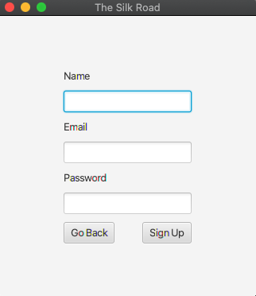
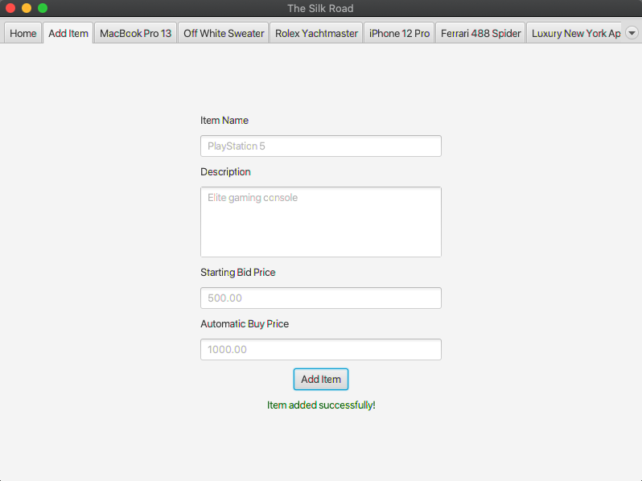

# Silk Road
This is my final project for EE 422C: Software Implementation and Design II taught by Dr. Vallath Nandakumar in Fall 2020. The project is an auction system that allows multiple clients to bid on items.

## Programmer POV
This project has two components: a **Server** and a **Client**, both of which have certain **Shared Resources** between them. This document will explain how each of these components works in the following sections.

### Server
The server uses an **Observer Pattern** which is a design architecture that implements the `Observable` interface. This allows client handlers to observe the server in order to notify the clients.

**Classes**
- `Server`: Sets up networking and client handler threads, initializes the database, and processes requests from clients.
- `ServerUtils`: Contains additional server functions to manage bidding and item information and sends clients status updates for login and bidding.
- `ClientHandler`: `Runnable` class that reads input from corresponding clients.
- `Database`: Creates, reads, and writes to two SQL databases for guests and items.
- `BidItem`: Contains all metadata about one particular bid item.
- `Guest`: Contains all metadata about one particular guest.

### Client
Each client is built using a JavaFX framework. The GUI contains multiple scenes to show the user the login and bidding screens. Each client runs on its own process and connects to the server separately, and the server handles the multithreading interactions of said clients.

**Classes**
- `Client`: Sets up networking, creates the GUI using JavaFX, sends messages to the server upon user interaction, and processes requests from the server.
- `UI`: Displays the different scenes of the GUI and updates GUI information when certain server messages are received using `Platform.runLater()` to run on the JavaFX thread.

### Shared Resources
Some resources are shared between the server and client for convenience and to facilitate server client communication.

**Classes**
- `Message`: Contains all possible data to be passed between the server and client. Messages generally contain a `Type` to distinguish what kind of message it is, the user the message is intended for, and some kind of data, whether it be login info, bid updates, or item specifications. Messages are passed using JSON over sockets.
- `User`: Contains all user credentials including name, email, password, and time of last visit.
- `Item`: Contains simplified item information purely to be displayed on the front end for clients.

## User POV
The user POV involves a single client and their experience using this application.

### User Registration
Users are either able to sign in or sign up upon entry. Clicking either of these buttons will navigate the user to a respective page.

A new user will be asked for their name, email, and password. Entering invalid information or causing other errors is appropriately handled by sending the user a status update on the issue.

### Home Page
Once a user has logged in, they are greeted with the home page. This screen also has buttons to either sign out or quit the applicatin entirely.

### Bidding
Users are able to bid on items and will receive instant feedback on whether their bid was successful and if they have won the auction. Entering invalid bids (non-numbers, negative numbers, or bids that are not high enough) will cause a status update to appear explaining the issue. Also, once an item is bought no other users are able to bid on it.

### Add Item
Users are also able to add new items to the auction by filling out data like the item name, description, bid price, and buy price, and the item will be added to everyone's bidding screens and users can immediately start bidding on it.

## Mode of Use
The server and client can both be launched from the same machine.

### Server
The server can be launched using the CLI command `java -jar Server.jar`. If the database is empty, it will automatically populate it and gracefully shutdown and store bidding information using a shutdown hook. To shut down the server, send a keyboard interrupt on the command line by pressing `CTRL+C`.

### Client
The client can be launched by double-clicking the `Client.jar` file. The server must be running before the client can be launched otherwise the client will immediately shut down. Multiple client instances should be launchable by also double-clicking, but if that doensn't work just make copies of `Client.jar` and double-click those.

## Additional Features
I implemented some additional features on top of the baseline requirements as both a challenge to myself and to make this application more functional.
- **Non-volatile database**: The database maintains its state even after shutdown as all item information is saved using a shutdown hook.
- **Java SQL Database**: SQL databases are used to maintain information about the guests and items.
- **JSON**: JSON packets are sent as strings between the server and client for communication.
- **Cryptography**: Passwords are never directly stored in the database and are instead hashed.
- **Observable Design Pattern**: Using this architecture allows the server to easily notify clients upon certain triggers.
- **Minimum Bidding Price**: Each item has a set minimum bidding price that must be greater than zero.
- **Buy Now Price**: Each item has an automatic buy price that allows a user to receive the item immediately when a high enough bid is sent.
- **Item Descriptions**: Each item has its own description that can be written when the item is added to the auction.
- **Nice GUI**: The GUI uses a variety of fonts and colors to make the user experience smooth. Additionally, `TabPanes` make it easy to flip between bidding items. Also, forms have placeholder text and can be submitted by pressing the `Enter` key.
- **Guest Login**: Guests can easily join the auction in two clicks by simply submitting an empty sign up form.
- **Add Item**: Items can easily and instantly be added to the auction from its own tab that has a form to collect all relevant information.

## References
Below are a list of references that I used for this project. It was challenging, but I was able to get through it with the help of StackOverflow.
- [Password Hashing](https://www.thesslstore.com/blog/difference-encryption-hashing-salting/)
- [Shutdown Hooks](https://www.geeksforgeeks.org/jvm-shutdown-hook-java/)
- [Gson](https://github.com/google/gson)
- [Java SQL](https://docs.oracle.com/javase/8/docs/api/java/sql/package-summary.html)
- [JavaFX TabPane](https://docs.oracle.com/javase/8/javafx/api/javafx/scene/control/TabPane.html)
- [JavaFX Children](https://stackoverflow.com/questions/27154996/replace-a-node-at-row-col-in-a-javafx-gridpane)
- [JavaFX Label](https://docs.oracle.com/javafx/2/ui_controls/label.htm)
- [JavaFX Font](https://docs.oracle.com/javafx/2/ui_controls/label.htm)
- [JavaFX TextArea](https://stackoverflow.com/questions/37458555/how-to-set-height-and-width-of-javafx-textarea)
- [Git Revert](https://stackoverflow.com/questions/5772192/how-can-i-reconcile-detached-head-with-master-origin)